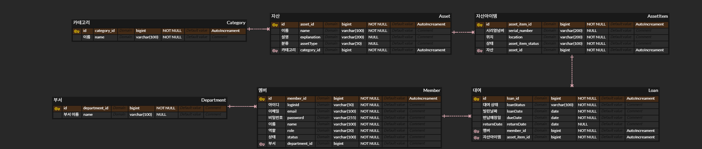

# AssetFlow

## 프로젝트 소개

AssetFlow는 기업/기관 내부에서 도서, 문서, 장비 등의 자산을 등록하고, 직원들에게 대여·예약·반납·연체·요청 처리를 제공하는 백오피스 시스템입니다.

단순 물품 관리 서비스가 아니라, 사내 자산의 상태와 대여 흐름을 관리하는 업무 시스템을 목표로 합니다.

## 주요 기능

- 회원 및 부서 관리
- 자산 등록 및 관리
- 개별 자산 품목 관리
- 자산 대여 및 반납 처리
- 사용자별 대여 이력 조회
- 관리자용 대여 현황 관리
- 예약, 연체, 요청 티켓 기능 확장 예정

## 기술 스택

- Java 17
- Spring Boot 3.5.15
- Spring Data JPA
- MySQL
- Gradle
- Lombok

## ERD 구조

## 개발 기록

상세 개발 과정과 설계 고민은 [HISTORY.md](./HISTORY.md)에 정리합니다.

## 현재 진행 상황

- [x] Spring Boot 프로젝트 생성
- [x] MySQL 연결
- [x] GitHub 저장소 연결
- [x] 핵심 도메인 엔티티 초안 작성
- [x] ERD 초안 작성
- [ ] Repository 구현
- [ ] 회원가입 API 구현
- [ ] 대여/반납 API 구현
